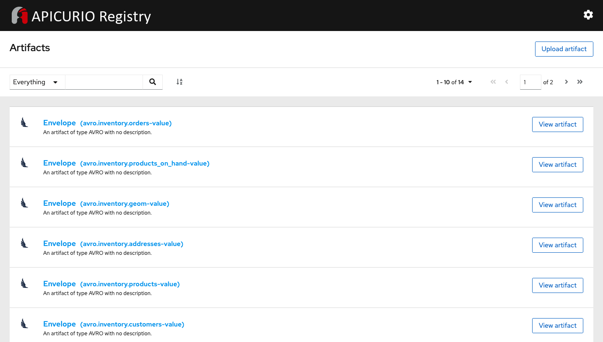

# Debezium - Avro serialization with Apicurio service registry

This tutorial demonstrates how to use [Debezium](https://debezium.io/) to monitor a MySQL database. As the data in the database changes, you will see the resulting event streams.

Debezium includes multiple connectors. In this tutorial, you will use the [MySQL connector](https://debezium.io/documentation/reference/1.3/connectors/mysql.html).

## Avro serialization

The default behavior is that the JSON converter includes the record’s message schema, which makes each record very verbose. Alternatively, you can serialize the record keys and values by using [Apache Avro](https://avro.apache.org/). To use Apache Avro serialization, you must deploy a schema registry that manages Avro message schemas and their versions.

The [Apicurio Registry](https://github.com/Apicurio/apicurio-registry) open-source project provides several components that work with Avro:

- An Avro converter that you can specify in Debezium connector configurations. This converter maps Kafka Connect schemas to Avro schemas. The converter then uses the Avro schemas to serialize the record keys and values into Avro’s compact binary form.

- An API and schema registry that tracks:

  - Avro schemas that are used in Kafka topics
  - Where the Avro converter sends the generated Avro schemas

### Prerequisites

- Docker is installed and running.

  This tutorial uses Docker and the Linux container images to run the required services. You should use the latest version of Docker. For more information, see the [Docker Engine installation documentation](https://docs.docker.com/engine/installation/).
  
- Kafkacat

- jq (for JSON processing)

## Starting the services

1. Clone this repository:

    ```bash
    git clone https://github.com/hguerrero/debezium-examples.git
    ```

1. Change to the following directory:

    ```bash
    cd debezium-examples/debezium-registry-avro
    ```

1. Start the environment

    ```bash
    docker-compose up -d
    ```

The last command will start the following components:

- Single node Zookeeper and Kafka cluster
- Single node Kafka Connect cluster
- Apicurio service registry
- MySQL database (ready for CDC)

## Apicurio converters

Configuring Avro at the Debezium Connector involves specifying the converter and schema registry as a part of the connectors configuration. The connector configuration file configures the connector but explicitly sets the (de-)serializers for the connector to use Avro and specifies the location of the Apicurio registry.

> The container image used  in this environment includes all the required libraries to access the connectors and converters. 

The following are the lines required to set the **key** and **value** converters and their respective registry configuration:

```json
        "key.converter": "io.apicurio.registry.utils.converter.AvroConverter",
        "key.converter.apicurio.registry.url": "http://registry:8080/api",
        "key.converter.apicurio.registry.global-id": "io.apicurio.registry.utils.serde.strategy.AutoRegisterIdStrategy",
        "kwy.converter.apicurio.registry.as-confluent": "true",
        "value.converter": "io.apicurio.registry.utils.converter.AvroConverter",
        "value.converter.apicurio.registry.url": "http://registry:8080/api",
        "value.converter.apicurio.registry.global-id": "io.apicurio.registry.utils.serde.strategy.AutoRegisterIdStrategy",
        "value.converter.apicurio.registry.as-confluent": "true"
```

> The compatibility mode allows you to use other providers tooling to deserialize and reuse the schemas in the Apicurio service registry.

### Create the connector

Let's create the Debezium connector to start capturing the changes of the database.

1. Create the connector using the REST API

    ```bash
    curl -X POST http://localhost:8083/connectors -H 'content-type:application/json' -d @dbz-mysql-connector-avro.json
    ```

### Check the data

The previos step created and started the connector. The database had some initial data that has been captured by Debezium and was send as events into Kafka. 

Let's check the information there.

1. Review the data using **kafkacat**:

   ```bash
   kafkacat -b localhost:9092 -t avro.inventory.customers -e
   ```

   > You will notice that the information is not human readable. That means it was serialized correctly with Avro.

2. To get back a readable version of the data, we need to tell *kafkacat* that there it needs to query the schema from the *Apicurio service registry* and use it to deserializace the records. Run the following command with the registry config:

   ```bash
   kafkacat -b localhost:9092 -t avro.inventory.customers -s avro -r http://localhost:8081/api/ccompat -e
   ```

   y you have the `jq` utility installed, try the following instead:

   ```bash
   kafkacat -b localhost:9092 -t avro.inventory.customers -s avro -r http://localhost:8081/api/ccompat -e | jq
   ```

You can now see the kafka record information containing only the `payload` as expected, but without the overhead of the Debezium `schema` as it is now externalized in the registry. 

If you access the *Apicurio schema registry* in the `http://localhost:8081/` url you will be able to find all the schema artifacts.



## Summary

Although Debezium makes it easy to capture database changes and record them in Kafka, one of the more important decisions you have to make is *how* those change events will be serialized in Kafka. Debezium allows you to select key and value *converters* to select from different type of options. The *Apicurio service registry* allows you to store externalized versions of the schema to minimize the payload to propagate.

